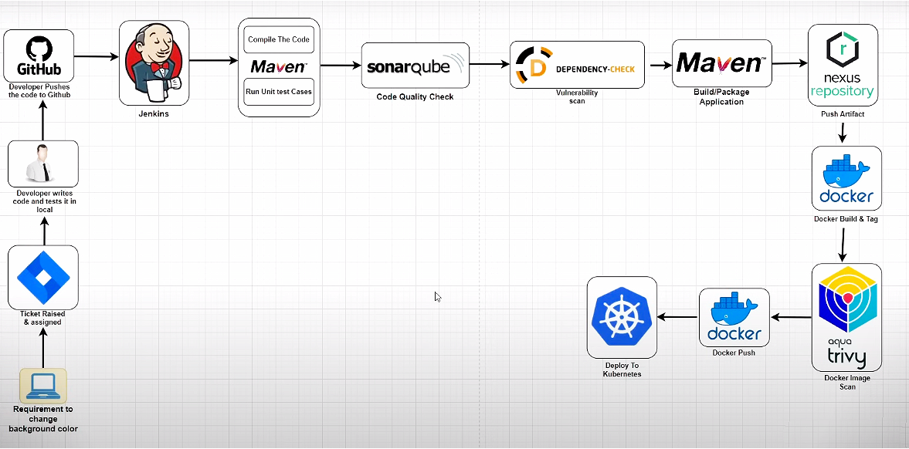
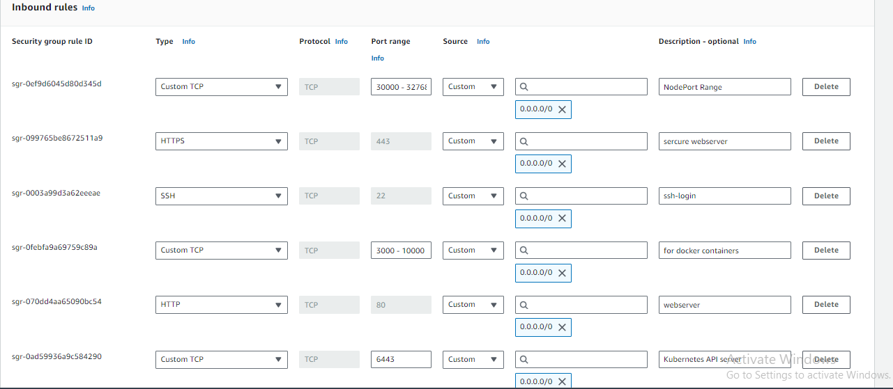

# Devops Project: CICD Pipeline

## Introduction
This documentation provides step-by-step instructions for setting up Jenkins, 
SonarQube, Nexus, Trivy, and Kubernetes, along with a Jenkins pipeline for a sample 
project.

### Architecture

<p align="center">
  
  </p>


### Security group configuration

<p align="center">
  
  </p>

### Prerequisites
5 Instances with required ports open for them.
Instance-1: Java, Jenkins, Docker, Trivy
Instance-2: Docker, SolarQube
Instance-3: Docker, Nexus
Instance-4: Docker, Kubernetes (Master)
Instance-5: Docker, Kubernetes (Worker)

### Terraform (Iaac)

You can use Terraform for Infrastructure management. Add credentials.tf update variables.tf and other manifest files according to your Project.
**Some Important Terraform Commands**
```bash
terraform validate
terraform plan
terraform apply
terraform apply -var-file=<variables-file.tfvars>
terraform show
terraform state list
terraform import resource_name.logical_name resouce_id 

```

# INSTALLATION OF APPLICATIONS ON INSTANCES:
**Jenkins Setup Documentation(Instance-1)**
Before setting up Jenkins, ensure that Java Development Kit (JDK) is installed on your system.
Jenkins Installation
Follow the steps in the official Jenkins installation documentation to install Jenkins on your Linux machine. [jenkins](https://www.jenkins.io/doc/book/installing/linux/)

**jenkins installation:**

```bash
#!/bin/bash
sudo apt update
sudo apt install fontconfig openjdk-17-jre -y
java -version
sudo wget -O /usr/share/keyrings/jenkins-keyring.asc \
  https://pkg.jenkins.io/debian-stable/jenkins.io-2023.key
echo deb [signed-by=/usr/share/keyrings/jenkins-keyring.asc] \
  https://pkg.jenkins.io/debian-stable binary/ | sudo tee \
  /etc/apt/sources.list.d/jenkins.list > /dev/null
sudo apt-get update
sudo apt-get install jenkins -y
sudo systemctl enable jenkins
sudo systemctl start jenkins
sudo systemctl status jenkins
```
**Install Docker on your VM.**
```bash
sudo apt install docker.io -y
```

**SonarQube Setup Documentation(Instance-2)**
1. Install Docker on your VM.
```bash
sudo apt install docker.io -y
```
2. Run the following command to start SonarQube in a Docker container:
```bash
docker run -d -p 9000:9000 sonarqube:lts-community
```


## Nexus Setup Documentation(Instance-3)
1. Install Docker on your VM.
```bash
sudo apt install docker.io -y
```
2. Run the following command to start Nexus in a Docker container:
```bash
docker run -d -p 8081:8081 sonatype/nexus3
```

## Kubernetes Installation (Instance-4&5)
**Go through Kubernetes-README.md file**


# Configurations on Instances:

**Instance:2(SonarQube)**
Login into server using InstanceIP:9000

Default Username and Password will be (Username: admin Password:admin). Generate Authentication Token which will be used in Jenkins to accesss SonarQube server.

Administration ==> Security ==> Users ==> Token of Administration ==> Name: anything ==> Generate
**Authentication token will look like this: squ_901699fc32ccf871e04d604a306f6025342504e5 note it**


**Instance:3(Nexus)**
Nexus default Password available in container. follow the step to find it.
```bash
sudo docker exec -it <container-id> /bin/bash
cat /nexus-data/admin.password
```


**Instance:1(Jenkins)**

Install Dependancies on Jenkins:
- **SonarQube Scanner**
- **Nexus Artifact Uploader**
- **Docker**
- **Docker Pipeline**
- **Docker-build-steps**
- **CloudBess Docker Build and Publish**
- **OWASP Dependency-Check**
- **Eclipse Temurin Installer**
- **Config File Provider**
- **Pipeline Maven Integration Plugin**
- **Kubernetes**
- **Kubernetes CLI**


**Run following command to provide so that any user can use docker commands. You must provide security practice in realworld cases**
```bash
sudo chmod 666 /var/run/docker.sock
```

**Manage Jenkins tools**

1. Jdk Installation: Name: jdk17 ==> Install Automatically ==> (select jdk17 version)
2. Git Installation: (Keep default settings)
3. SonarScanner Installation: Name: sonar-scanner ==> Install Automatically ==> (latest version)
4. Maven Installation: Name: maven3 ==> Install Automatically ==> 3.6.3
5. Dependency-Check Installation: Name: DC ==> Install Automatically ==> 6.5.1
6. Docker: Name: docker ==> Install Automatically ==> latest


**Add/Create Credentials**
1. SonarQube: Kind=(secret text), secret=(paste the token which was created earlier), ID=(sonar-scanner), Description=(sonar-scanner)
2. DockerHub: Kind=(username with password), Username=(docker-username), Password=(docker-password), ID=(dockercred), Description=(dockercred)
3. Kubernetes Service account: Kind=(secret text), secret=(paste the token created by kubernetes Service account), ID=(k8s-token), Description=(k8s-token)


**Manage System**
SonarQube Servers ==> SonarQube Installation ==> Name: sonar ==> Server Url: <add SonarQube server url> ==> Server Authentication token: (select the sonar-scanner credential)

**Config file provider**
add new config ==> Global Maven settings ==> ID = global-maven ==> content ==> (add the following entry which is already present but commented use it and update) 
```xml
<server>
    <id>maven-releases</id>
    <username>admin</username>
    <password>lokesh</password>
</server>
<server>
    <id>maven-snapshots</id>
    <username>admin</username>
    <password>lokesh</password>
</server>
```
*id= add nexus maven repo name (here we will use releases and snapshots)*

*username=nexus-username*

*password= nexus-password*

We should not use password directly so we can use server credentials to store username password


**Update the POM.xml which is availabel in repo**

Update URL or IP address in repository section, Update for maven-releases & maven-snapshots.


**Create Pipeline Project**

Jenkinsfile is available in repo update according to your setup and credentails. Add stage one by one and run the pipeline.

Use pipeline syntax to create pipeline stages. You get structured pipeline view where you can define your data according to that your script will be created. Add that block of script in stages.

Consider you have done till "Deploy To Nexus". Now you will be able to see the artifacts in Nexus repo under maven-snapshots.


**Instance 4&5(Kubernetes)**

After setup of K8s, Create NameSpace, Create Service Account, Create Role, Bind the role to service Account. Manifest files are available in repository.

*Generate token using service account in the namespace*
```bash
kubectl -n webapps describe secret k8s-websecret
```
Note this Token and create credential in jenkins to use in pipeline.


## Trivy Installation on Instance-1: 
1. **Install required dependencies:**
```bash
sudo apt-get install wget apt-transport-https gnupg lsb-release
```
2. **Add Trivy GPG key:**
```bash
wget -qO - https://aquasecurity.github.io/trivy-repo/deb/public.key | sudo gpg --dearmor -o /usr/share/keyrings/trivy.gpg
```
3. **Add Trivy repository:**
```bash
echo "deb [signed-by=/usr/share/keyrings/trivy.gpg] https://aquasecurity.github.io/trivy-repo/deb $(lsb_release -sc) main" | sudo tee /etc/apt/sources.list.d/trivy.list
```
4. **Update package list:**
```bash
sudo apt-get update
```
5. **Install Trivy:**
```bash
sudo apt-get install trivy -y
```


**Start Creating the further pipeline**


### Use of Kubernetes Helm Charts

I have created Helm chart & its deployment, service, values files with same configuration. To use you just need to configure the shell script little bit.

Update jenkinsfile only for kubernetes deployment part.:

```bash
stage('Kubernetes helm chart') {
    steps {
        dir('ekart-helm-chart') {
            withKubeConfig(caCertificate: '',
                           clusterName: '',
                           contextName: '',
                           credentialsId: 'k8s-token',
                           namespace: 'webapps',
                           restrictKubeConfigAccess: false,
                           serverUrl: 'https://172.31.82.201:6443') {
                sh 'helm install ekart .'
            }
        }
    }
}
```


